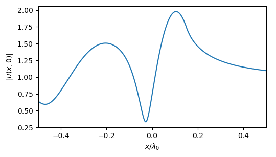
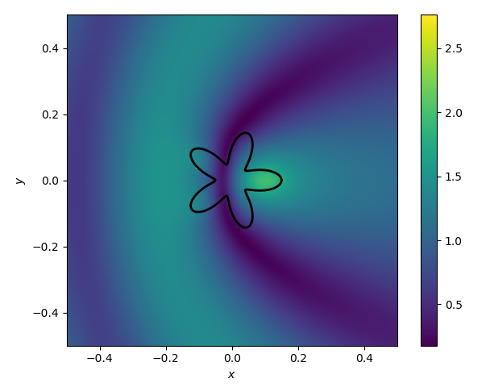
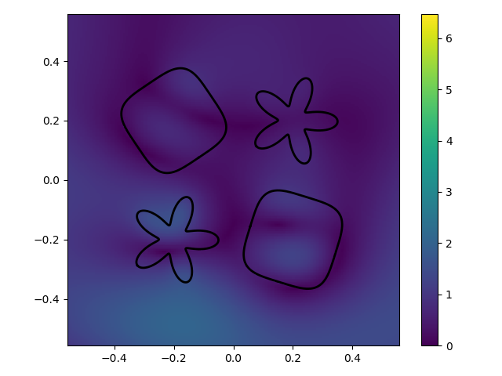

# Tutorial 1: Solving a Simple Multiple-Scattering Problem
#### Scattering from one particle

In order to speed up computations, ParticleScattering depends on grouping
identical shapes (rotated versions of the same shape are considered identical).
Thus solving multiple-scattering problems is syntactically similar to solving
for a single particle.

In this example, we will simulate TM plane-wave scattering ``e^{ik(\cos(\θ_i),\sin(\θ_i)) \cdot \mathbf{r}}``
from a single rounded star, parametrized by the equation

```math
(x(\theta), y(\theta)) = [R + d \cos(5\theta)](\cos \theta, \sin \theta), \quad
R = 0.1\lambda_0, d = 0.05\lambda_0,
```

which is supplied by `rounded_star`. For now, we discretize the shape with `N=260`
nodes and `P=10` cylindrical harmonics &ndash; for more information on the
relationship between these parameters and the various resulting errors, see
[Choosing Minimal `N` and `P`](@ref).

```julia
λ0 = 1 #doesn't matter since everything is normalized to λ0
k0 = 2π/λ0
kin = 3k0
θ_i = 0.0 #incident wave is left->right

N = 260
P = 10
shapes = [rounded_star(0.1λ0, 0.05λ0, 5, N)]
ids = [1] # the particle at centers[1,:] has the parametrization shapes[ids[1]]
centers = [0.0 0.0] # our particle is centered at the origin
φs = [0.0] #zero rotation angle
sp = ScatteringProblem(shapes, ids, centers, φs)
```

Now that the scattering problem is set up, we solve for the cylindrical harmonics
coefficients and potential densities, respectively, by using

```julia
beta,inner = solve_particle_scattering(k0, kin, P, sp::ScatteringProblem, θ_i)
```

These can be used to calculate the scattered field at any point in space using
low-level function `scatteredField`, or strictly outside the circle of radius `shapes[1].R`
with `scattered_field_multipole`. For large numbers of calculation points, however, it is
easier to use `calc_near_field` which performs `solve_particle_scattering` and
calculates the total (incident + scattered) field at every point using the most
appropriate method:

```julia
#calculate field on the x-axis passing through the particle
points = [linspace(-0.5λ0, 0.5λ0, 200)  zeros(200)]
u = calc_near_field(k0, kin, P, sp, points, θ_i)
plot(points[:,1]/λ0, abs.(u))
```



Similarly, a 2D plot can be drawn of the total field around the scatterer:
```julia
plot_near_field(k0, kin, P, sp::ScatteringProblem, θ_i;
    x_points = 201, y_points = 201, border = 0.5λ0*[-1;1;-1;1])
```



**Note:**
In practice, converting the shape potential densities to cylindrical harmonics
is inefficient here as we only have one scatterer, and `solvePotentialShapePW`
would be more accurate. This is meant only as an introductory example to the
ParticleScattering syntax.

#### Scattering from a small grid of particles
Expanding the example above to a collection of different particles is straightforward:

```julia
λ0 = 1 #doesn't matter since everything is normalized to λ0
k0 = 2π/λ0
kin = 3k0
θ_i = π/2 #incident wave is down->up

N_squircle = 200
N_star = 260
P = 10
shapes = [rounded_star(0.1λ0, 0.05λ0, 5, N_star);
            squircle(0.15λ0, N_squircle)]
ids = [1;2;2;1]
centers =  square_grid(2, 0.4λ0) #2x2 grid with distance 0.4λ0
φs = 2π*rand(4) #zero rotation angles
sp = ScatteringProblem(shapes, ids, centers, φs)
```

Looking at the ``4 \times 2`` array `centers`, the coordinates of the `m`-th
shape are given by `centers[m,:]`, and its rotation angle is stored in `φs[m]`.
Likewise, `ids[m]` tells us if the shape has parametrization `shapes[1]`
 &ndash; in this case a rounded star &ndash; or `shapes[2]`, a squircle. It is
 imperative that the order of these arrays remain consistent for the solver
to correctly precompute the scattering matrix transformation for each particle.
Furthermore, `shapes` should not contain copies of the same shape, as that will
lead to unnecessary computations.

Plotting the near field with the code
```julia
data = plot_near_field(k0, kin, P, sp, θ_i)
colorbar()
```
yields the following near-field plot:



The reason the plot is mostly dark is that `plot_near_field` automatically scales
the colors up to the maximum value calculated, which in this case happens to be
a glitch due to inaccurate calculations close to a boundary. While this issue
can be somewhat alleviated by increasing `N`, it will remain due to the
quadrature method used here. Fortunately, this does not affect the results off
the shape boundaries, and can be safely ignored by calling `clim([0.0;4.0])`.
