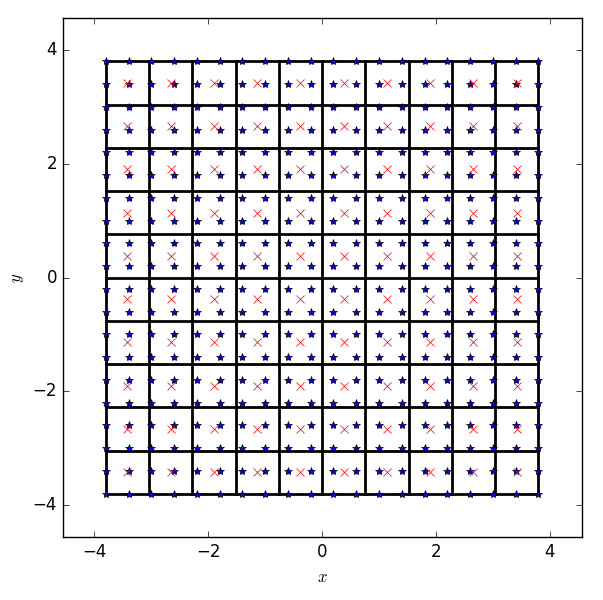
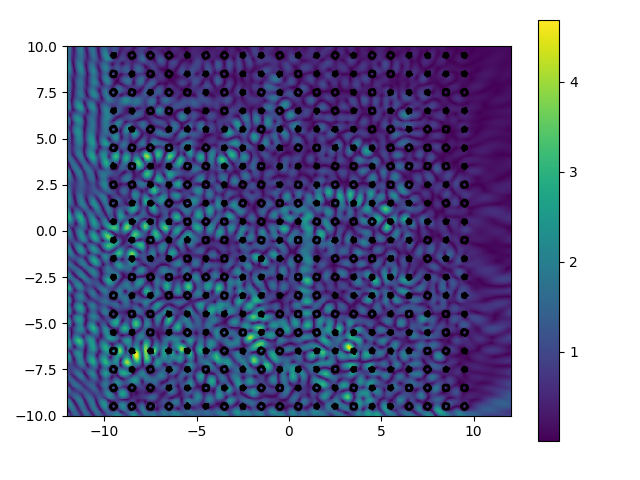
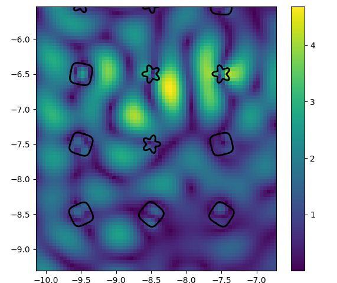
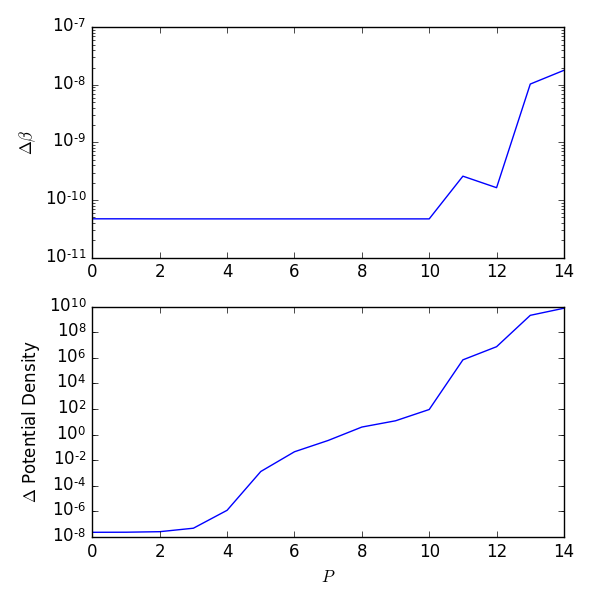

# [Tutorial 2: Accelerating Solutions with FMM](@id tutorial2)

In this tutorial, we examine scattering from several hundreds of particles, and
use the built-in Fast Multipole Method (FMM) implementation to provide faster
results.
FMM groups nearby particles and approximates their cumulative effect on "far"
particles. Here, the grouping is done by drawing a square grid over computational
region encompassing the particles. The error of these approximations is fairly
controllable, especially for mid- to high-frequency scattering.

Another difference between the direct and FMM solvers is that the latter requires
an iterative solver for the system of equations (GMRES is used here). Thus a
certain residual tolerance must be defined at which point the GMRES process
terminates.

The scattering problem here is set up by

```julia
using ParticleScattering, PyPlot
λ0 = 1 #doesn't matter since everything is normalized to λ0
k0 = 2π/λ0
kin = 3k0
θ_i = π/4 #incident wave e^{i k_0 (1/sqrt{2},1/sqrt{2}) \cdot \mathbf{r}}

N_squircle = 200
N_star = 210
P = 10

M = 20
shapes = [rounded_star(0.1λ0, 0.03λ0, 5, N_star);
            squircle(0.15λ0, N_squircle)]
centers =  square_grid(M, λ0) #MxM grid with distance λ0
ids = rand(1:2, M^2)
φs = 2π*rand(M^2) #random rotation angles
sp = ScatteringProblem(shapes, ids, centers, φs)
```

To setup FMM, we use the constructor `FMMoptions` with the following options:

```julia
FMM::Bool       # Is FMM used? (default: false)
nx::Integer     # number of groups in x direction (required if dx is not
                # specified)
dx::Real        # group height & width (required if nx is not specified)
acc::Integer    # accuracy digits for translation truncation, and also for
                # GMRES if tol is not given (required)
tol::Real       # GMRES tolerance (default: 10^{-acc})
method::String  # method used: for now only "pre" (default: "pre")
```

For this problem, we choose ``6`` digits of accuracy and grouping into
``(M/2)^2`` boxes. The grouping can be viewed by calling `divideSpace`:

```julia
fmm_options = FMMoptions(true, acc = 6, nx = div(M,2))
divideSpace(centers, fmm_options; drawGroups = true)
```

In this plot, the red markers denote the group centers while stars denote
particle centers (the particles can be drawn on top of this plot with
`draw_shapes`). At first, it might look strange that parts of many particles lie
outside the FMM group; however, the FMM is used only after the particles are
converted to line sources, and are thus fully contained in the FMM grid.



Calculating and plotting the near or far fields with FMM is just as in the
[previous tutorial](@ref scattering_small_grid), except we must supply the
`FMMoptions` object:

```julia
plot_near_field(k0, kin, P, sp, PlaneWave(θ_i), opt = fmm_options,
                border = [-12;12;-10;10], x_points = 480, y_points = 400)
colorbar()
```





**Note:**
Currently, FMM is used to accelerate the solution of the scattering problem,
but not the field calculation in `plot_near_field`.

#### Direct vs. FMM timing


#### Which is more accurate?
Intuitively, the direct approach is more accurate than the FMM with
its various approximations and iterative solution method. However, inaccuracies
can arise in the direct solution of even the simplest scattering problems:

```julia
k0 = 0.01
kin = 0.02
shapes = [squircle(1, 200)]
ids = [1;1]
centers = [0.0 0.0; 5.0 0.0]
phis = [0.0;0.0]
sp = ScatteringProblem(shapes, ids, centers, phis)
Pmax = 15
```

We solve this problem using the direct approach and with FMM, and then compare
both the multipole coefficients ``\beta`` and the resulting potential densities:

```julia
betas = Array{Vector}(Pmax)
betas_FMM = Array{Vector}(Pmax)
inners = Array{Vector}(Pmax)
inners_FMM = Array{Vector}(Pmax)
fmmopts = ParticleScattering.FMMoptions(true, nx = 1, acc = 9)
for P = 1:Pmax
	betas[P], inners[P] = solve_particle_scattering(k0, kin, P, sp, PlaneWave();
                            verbose = false)
	res, inners_FMM[P] = solve_particle_scattering_FMM(k0, kin, P, sp, PlaneWave(),
                            fmmopts; verbose = false)
	betas_FMM[P] = res[1]
end

errnorm(x,y) = norm(x-y)/norm(x)

figure()
subplot(2,1,1)
semilogy([errnorm(betas_FMM[i], betas[i]) for i = 1:Pmax])
ylabel("\$\\Delta \\beta\$")
subplot(2,1,2)
semilogy([errnorm(inners_FMM[i], inners[i]) for i = 1:Pmax])
xlabel("\$ P \$")
ylabel("\$ \\Delta \$" * " Potential Density")
```


In both subplots, we see that increasing `P` actually leads to a decrease in
accuracy (plotting the results separately also shows that the FMM results stay
the same, while the direct results blow up). This is due to two main reasons -
conditioning of the system matrix, and the fact that high-order cylindrical
harmonics are responsible for substantially greater potential densities than
lower-order ones. Both of these are impacted by the number of particles as well
as the wavelength.

This ties in with [Choosing Minimal N and P](@ref minimalNP) &ndash; not only does
increasing `P` far beyond that required for a certain error impact runtime, but
can also increase the error in the solution.

Of course, FMM was not really used here as `nx == 1` means both particles are in
the same FMM group, and the maintained accuracy is purely due to the iterative
system matrix solution used in `solve_particle_scattering_FMM`, GMRES.
