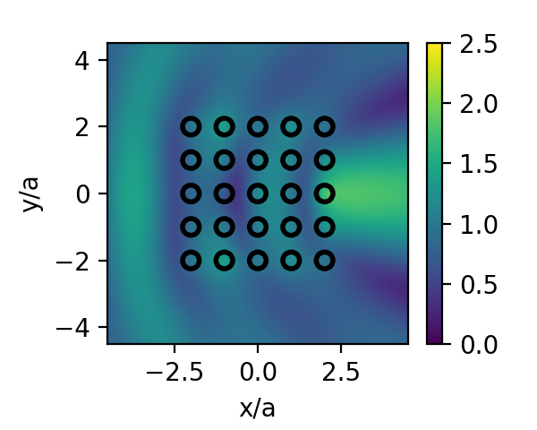
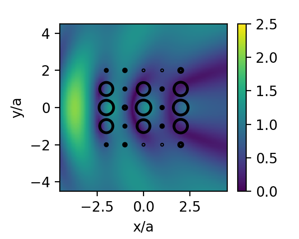
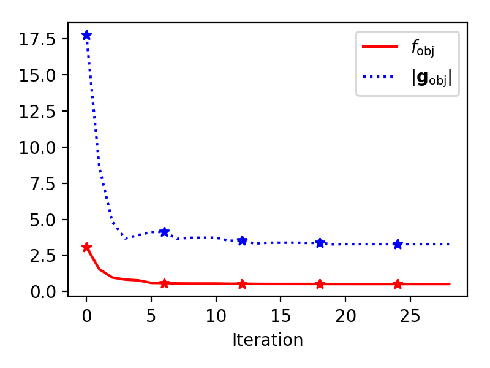

#  Tutorial 3: Angle Optimization

In this tutorial, we build upon the [previous tutorial]@(ref tutorial2) by
optimizing the rotation angles of the particles (`φs`) to maximize the field
intensity at a specific point.
Depending on the scattering problem, wavelengths, and incident field,
optimization can have a major or minor effect on the field.
For this purpose, we utilize `Optim`, a Julia package for nonlinear optimization.
First we set up our scattering problem as before:


We now select the optimization method and select its options.
In most cases, this combination of BFGS with a backtracking line search will
yield accurate results in fast time;
other line searches that require re-evaluation of the gradient will be
significantly slower.

```@raw html
<div style="text-align:center">


</div><p style="clear:both;">
```


```@raw html
<p style="text-align:center;"></p>
```
